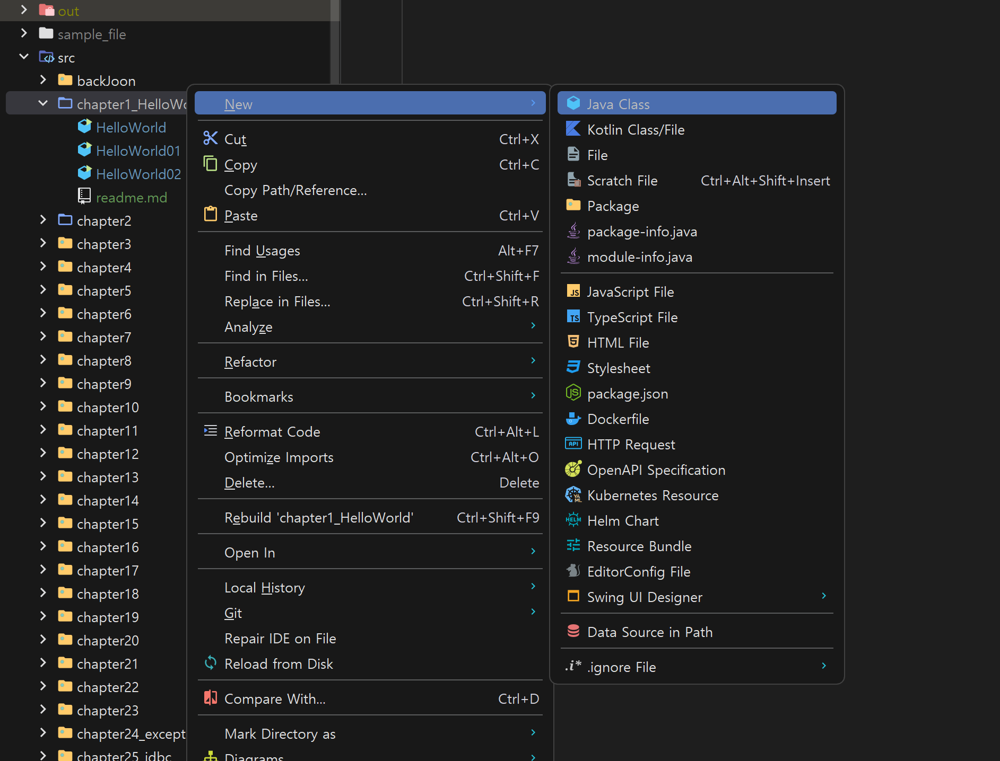
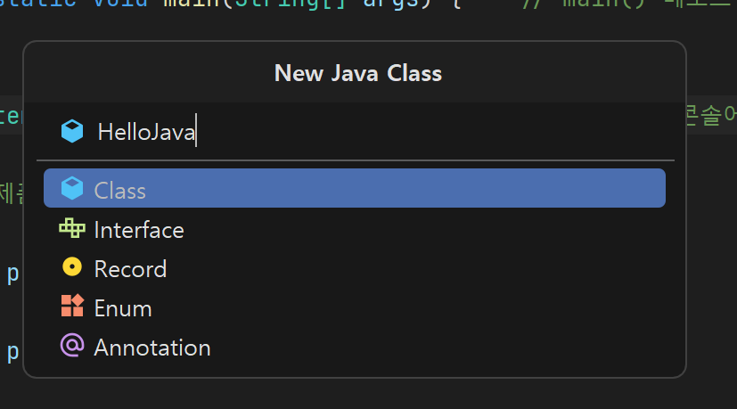
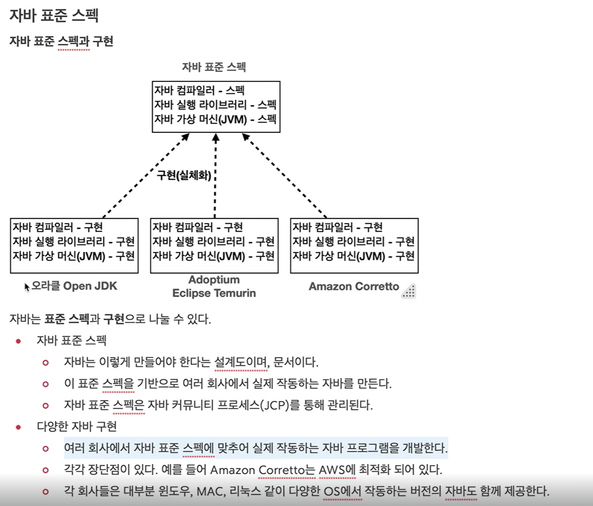
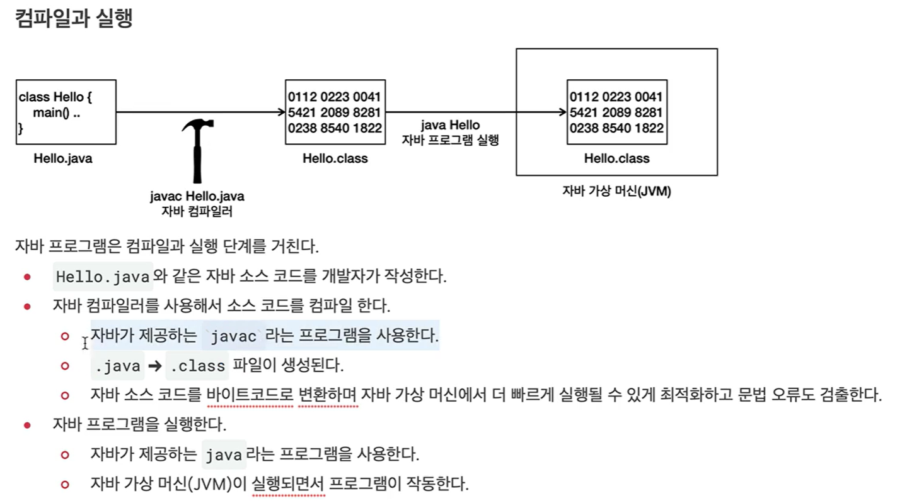
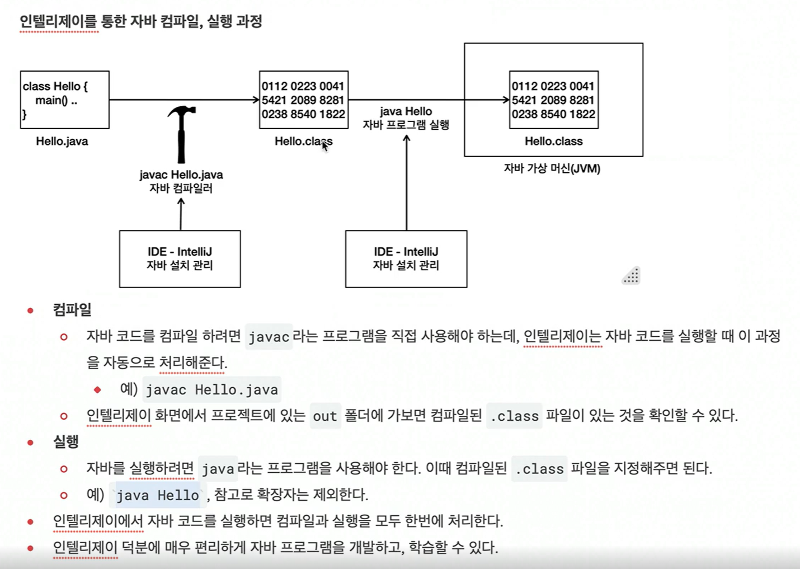

자바 클래스 파일 생성

<p align="center">
  
</p>

<p align="center">
  
</p>

`코드 입력`

```java
package chapter1_HelloWorld;

public class HelloJava {
    public static void main(String[] args) {
        System.out.println("Hello World");
    }
}

```
`주의`
> 자바 언어는 대소문자를 구분한다. 대소문자가 다르면 오류가 발생할 수 있다.

실행결과
```shell
Hello World

Process finished with exit code 0
```
### `public class HelloJava`
- HelloJava 를 클래스라 한다. 
- 클래스(class)의 개념을 학습해야 이해할 수 있다. 클래스는 뒤에서 학습한다.
- 지금은 단순히 HelloJava. java 라는 파일을 만들었다고 이해하면 된다.
- 파일명과 클래스 이름이 같아야 한다.
- `{}` 블록을 사용해서 클래스의 시작과 끝을 나타낸다.


### `public static void main(String[] args)`
- main 메서드라 한다. 함수, 메서드의 개념을 학습해야 이해할 수 있다. 함수, 메서드는 뒤에서 학습한다.
- 자바는 main(String[] args) 메서드를 찾아서 프로그램을 시작한다.
- 지금은 단순히 main 은 프로그램의 시작점이라고 이해하면 된다.
{} 블록을 사용해서 메서드의 시작과 끝을 나타낸다.

### `System.out.println("hello java");`
- System.out.println() : 값을 콘솔에 출력하는 기능이다.
- "hello java" : 자바는 문자열을 사용할 때 " (쌍따옴표)를 사용한다. 쌍따옴표 사이에 원하는 문자열을 감싸면 된다.
- ; : 자바는 세미콜론으로 문장을 구분한다. 문장이 끝나면 세미콜론을 필수로 넣어주어야 한다.


---

### 주석(comment)
- 소스 코드가 복잡하다면 소스 코드에 대한 이해를 돕기 위해 설명을 적어두고 싶을 수 있다.
- 또는 특정 코드를 지우지 않고, 잠시 실행을 막아두고 싶을 때도 있다.
이럴 때 주석을 사용하면 된다. 자바는 주석이 있는 곳을 무시한다.

#### 주석의 종류

- 한 줄 주석 (single line comment)<br>
`//` 기호로 시작한다. 이 기호 이후의 모든 텍스트는 주석으로 처리된다.

- 여러 줄 주석(multi line comment)
`/*` 로 시작하고 `*/`로 끝난다.<br>
이 사이의 모든 텍스트는 주석으로 처리된다.

---
<p align="center">
  
</p>

<p align="center">
  
</p>

<p align="center">
  
</p>

인텔리제이 환경에서는 java클래스파일 컴파일도 해주고 클래스 파일을 실행도 해준다.
