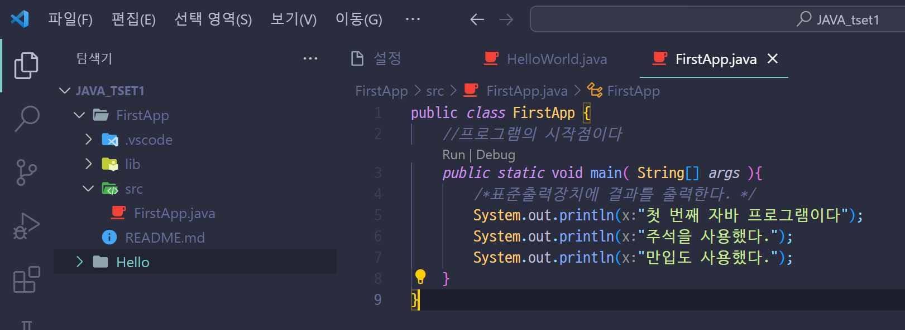
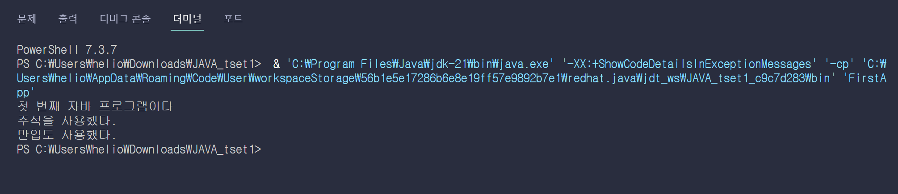

### 자바 코드의 구조

> [!IMPORTANT]
> 자바는 객체지향 프로그래밍 언어이기 때문에 **객체와 객체를 만드는 틀인 class에 대한 이해**가 매우 중요하다.
 

객체지향 프로그래밍을 학습하기전 프로그램을 구성하는 기본 요소들과 규칙, 변수와 상수의 종류 그리고 그들의 데이터의 형과 형 변환에 대해 알아본다.

```java
Source : FirstApp.java

class FirstApp {
//프로그램의 시작점이다.
public static void main( String[] args ) {
/* 표준출력장치에 결과를 출력한다*/
System.out.println("첫 번째 자바 프로그램이다.");
System.out.println("주석을 사용했다.");
System.out.println("만입도 사용했다.");
	}
}
```




### 자바 프로그램의 기본 구조
```java
public class 작성자가 정의하는 클래스 이름 { 
	public static void main( String [] args ){
		프로그램 명령문 1;
		프로그램 명령문 2;
		...
		프로그램 명령문 n;
	}
}
```

---
>[!Note] 설명
1. class 뒤에 적힌 단어는 프로그램(클래스) 이름을 적는다
2. 자바 프로그램은 class로 구성되며 class 는 { 로 시작해서 } 로 끝난다.
3. 자바 프로그램의 실행 시작점은 main() 메소드이며 "public static void main( String[] args )" 와 같이 기술한다.
4. 여러 개의 명령문을 블록으로 묶을 때 {, } 를 사용한다.
5. 각 자바 명령문은 ;(세미콜론)으로 끝난다.

>[!Note] public 는 무엇인가?
>public는 자바 프로그래밍 할 때 사용하는 접근 제어자이다. class 앞에 붙은 public는 조금 다른 의미로 쓰인다.
>이외에 public가 들어가면 어떤 클래스에서도 접근 가능할 수 있도록 열어놓는다는 의미로 이해하고 있자.
>현시점에서 너무 깊게는 파고 들지말자.. 첫 포스트부터 하나하나 다 파고들려고 보니 진도가 안나간다.. 친구말로는 나중에 더 자세하게 알아도 된다고 하니 
>추후 public말고도 private도 있던데 접근 제어자에 대해 자세히 포스팅 할 예정이다.

기본 구조에 나온 단어들을 가볍게 알아보자.
- public : 메서드의 접근 제어자로, 누구나 이 메서드에 접근할 수 있다는 의미.
- static : 메서드에 static 가 지정되어 있으면 이 메서드는 인스턴스를 생성하지 않아도 실행할 수 있다는 것을 의미한다.
- void : 메서드의 리턴값이 없음을 의미한다. (void 는 '텅 빈'을 의미한다)
- String[] : String 은 문자열을 나타내는 자바의 자료형이다.
	- []는 값이 여러 개로 이루어진 배열이라는 것을 의미한다
- args : String[] 자료형의 변수명이다.
- System.out.println : 표준 출력으로 데이터를 보내는 자바의 내장 메서드로 문자열을 화면에 출력한다.


자세히 설명한다면 훨씬 알아야 할 내용이 많다. 비전공자인 나와 이걸 보는 자바입문자들은 이정도만 알고 진행해도 문제 될 게 없다.

>[!important] 중요!
>프로그램을 실행할려면 무조건 main 메서드는 있어야 하며 위에서 보여준 자바의 기본 구조 형태만 가능하다. 일종의 자바의 규칙이라고 생각하면 된다.


클래스와 메서드란 무엇일까

```java
/* 클래스 블록 */
public class JavaFirst{
    /* 메서드 블록 */
    [public | private | protected] [static] (리턴자료형|void) 메서드명1 (입력자료형 매개변수, ...) {

        명령문(statement);
        ...
    }

    /* 메서드 블록 */
    [public | private | protected] [static] (리턴자료형|void) 메서드명2 (입력자료형 매개변수, ...){

        명령문(statement);
        ...
    }
    
    ...
}
```

자바 코드의 가장 바깥쪽 영역은 클래스 블록이다.
클래스 명은 사용자 마음대로 지을 수 있으나 소스 파일의 이름과 동일하게 지어야한다.
클래스 블록은 여러 메서드 블록을 포함한다.

1. `[public | private | protected] ` 는 셋 중 하나가 오거나 아무것도 오지 않을 수 있다는 의미이다. 메서드의 접근 제어자이다.
2. `[static]` static 키워드가 올 수도 있고 안올 수도 있다는 의미이다. static 키워드가 붙으면 static 메서드가 된다
3. `(리턴자료형|void)` : 메서드가 실행된 후 리턴 되는 값의 자료형을 의미한다. 리턴값이 없는 경우 void로 표기한다. 반대로 리턴값이 있는 경우 반드시 리턴 자료형을 표기해야 한다.[]가 아닌 ()로 표기한 이유는 반드시 기재를 해야한다. 리턴값이 있든 없는지..
4. 메서드명 : 메서드의 이름이다. 메서드 명 뒤에 이어지는 괄호 안의 값들(입력자료형 매개변수 등)은 메서드의 입력 인자를 의미한다.
	- 입력 인자 : '입력 자료형+매개변수명' 형태로 이루어지며 개수에 제한이 없다. 클래스 내에는 이러한 매서드를 여러 개 만들 수 있다.


>[!Note] 메서드 (Method)는 무엇인가?
>메서드는 클래스(Class)의 내부에 존재하는 영역으로, 특정 기능을 하는 코드를 묶어서 나타내는 것을 말한다.
>
>>[!note] Point. 특정 기능을 수행하기 위한 코드들의 묶음이다.
>>특정 기능을 수행한다는 것은 데이터를 입력받아 해당 데이터를 일련의 처리 과정을 통해 만들어진 결과값을 반환하는 것을 의미한다.
>메서드에 static 키워드가 붙으면 클래스 메서드가 되어 객체를 만들지 않아도 '클래스명.메서드명' 형태로 호출할 수 있다.
>메서드 블록 안에는 명령문이 있는데 컴퓨터에 무엇가 일을 시키는 문장을 명령문(statement) 이라고 한다.
>


클래스 블록과 메서드 블록

![[Pasted image 20231012154322.png]]
>[!important] 명령문은 방드시 세미콜론(`;`)이 붙여서 문장이 끝났음을 표시해야한다.
>메서드블록안에는 명령문이 여러개 들어갈 수있다.


---


## 변수와 상수의 개요
프로그램에서는 변수(Variable)와 상수(Constant)를 사용한다.


변수  : 하나의 값을 저장할 수 있는 메모리 번지에 붙여진 이름

> [!NOTE] 변수란
> 변수는 흔히 값을 넣을 수 있는 빈 상자와 같다고 표현한다.
> 즉, 변수는 값을 대입하여 사용할 수 있으며, 값에는 어떤 형태가 정해져야 하는데, 이 형태가 바로 자료형이다.

``` java
int a; // 변수 선수
a = 10; // 변수 초기화
```
int 는 자료형이고, a는 변수, a의 값을 10으로 초기화했다.


```java
public class VariableTest {

    public static void main( String[] args ){

        String city = "Seoul";

        int rank = 1;

  

        System.out.println( "city = " + city );

        System.out.println( "rank= " + rank ) ;

  

        city = "Tokyo";

        rank = 11;

  

        System.out.println("city = " + city );

        System.out.println( "rank = " + rank );

    }

}
```
여기서 문자열 연결을 하기위해 + 연산자를 사용했다
(  [[Java문자열 연결하는 방법 (+연산자)]] )

#### 변수의 특징
1. 변수는 반드시 int, String과 같은 [[자바의 데이터 타입(Primitive type, Reference type)|타입(Type)]]을 선언해야 하며, 선언된 변수의 타입과 할당되는 실제 상수 값의 타입이 일치하는 것을 원칙으로 한다.
2. 변수는 언제든지 새로운 값을 할당할 수 있으며, 마지막으로 할당된 값이 최종적으로 기억된다.
3. 변수의 이름은 프로그래머가 마음대로 지정하면 된다. 다만 이름명명에는 몇가지 규칙은 지켜야한다.

#### 이름의 명명 규칙
변수와 클래스의 이름 등등 패키지, 인터페이스, 메소드 등의 이름을 명명할때 공통 규칙이 있다

1. 대소문자를 구분한다
	- HelloWorld와 helloWorld는 다른 이름이다.
2. 첫 글자가 숫자이어서는 안 된다.
	- 8eight은 허용되지 않으나 eight8은 허용된다.
3. 특수문자는 `"_" 와 $" `만 사용할 수 있다.
	- %percent는 허용되지 않으나, $dollar는 허용된다.
4. [[자바의 예약어|예약어]]는 사용할 수 없다
	- 자바에게 특별한 의미를 가지는 약속된 용어들이라 그 용어들은 피해야 한다.

>[!question] 잘못된 변수명을 사용한 예
>```java
>int 1st; //변수명은 숫자로 시작할 수 없다.
>int a#; //변수명에 특수문자는 사용할수없다
>int class;  //변수명에 키워드(예약어)는 사용할 수 없다.
>```


### 클래스 이름 명명법
1. 클래스 이름의 첫 글자는 ==대문자==로 표기한다.
	- 그러나 클래스 이름의 첫 문자를 소문자로 기술해도 에러는 발생하지 않는다
2. 클래스 이름이 2개 이상의 단어로 이루어질 때는 각 단어의 첫 글자를 대문자로 기술한다.(캐멀 스타일임)
	- class VariableTest
3. 변수 이름의 첫 글자는 소문자로 표기한다.
	- 변수 이름은 한글을 사용할 수 있고 `_ , $` 등의 문자로 시작해도 되지만 좋은 방법은 아니다.
4. 변수 이름이 2개 이상의 단어로 조합될 때는 두 번째 단어부터는 첫 글자를 대문자로 표기한다.
	- 예시) int result = oldValue + newValue;


> [!summary] 정리

클래스 이름 짓는 방법
- 클래스명은 명사로 한다
- 클래스명은 대문자로 시작한다
- 여러 개 의 단어를 조합하여 만들 경우 각 단어의 첫 번째 글자는 대문자이어야 한다. <-- 파스칼  케이스 라고도 한다.
- 소스파일명(=클래스명)이므로 대문자로 시작한다.
```java
class Cookie {}
class ChocoCookie {} //파스칼 케이스의 예시
```

메서드 이름 짓는 방법
   - 메서드명은 동사로 시작한다
   - 메서드명은 소문자로 시작한다
   - 여러 개의 단어를 조합하여 만들 경우 맨 첫 글자를 제외한 나머지 단어의 첫 글자는 대문자로 써서 구분한다. <-- 카멜 케이스라고도 한다
```java
run();
runFast();
getBackground(); //이건 카멜 케이스의 예시
```

변수 이름 짓는 방법
   - 변수 이름은 짧지만 의미가 있어야한다. 즉 변수명만 봐도 사용한 이유를 알 수 있도록 지어야 한다.
   - 순서를 의미학 임시로 쓰이는 정수의 변수명은 `i, j, k, m, n` 을 사용한다. 문자의 경우 `c, d, e` 등을 사용한다.
   - 변수명에 `_, $` 을 쓸수는 있지만 시작 문자로 사용하는 것은 지양하는것이 좋다.
```java
String userName;
float lineWidth;
int i; //주로 반복문에서 사용
char c; //주로 반복문에서 사용용
```


---
### 변수와 상수의 사용
프로그램은 명령문(Instruction)과 데이터(Data)의 집합체이다.
자바에서의 객체(Object)도 실제로는 **명령문과 데이터를 사용하는 진보된 방법**이라고 할 수 있다.
데이터는 변수와 상수로 구분되며, 명령문은 이 변수와 상수를 이용해서 다양한 연산(작업)을 한다.

### 자료형(Data type) [[자바의 데이터 타입(Primitive type, Reference type)]]
#### 변수에 지정하는 기본 데이터 타입 (Primitive data type) 
변수에 지정하는 데이터 타입은 크게 2가지 데이터 타입이 있다.

>[!Note] 타입(Data type) 이란?
>자료형이라고도 한다.
>해당 데이터가 메모리에 어떻게 저장되고, 프로그램에서 어떻게 처리되어야 하는지를 명시적으로 알려주는 것이다.
>
>>[!Note] 데이터의 종류와 크기를 결정하는 기본 구성 요소로 숫자, 문자열처럼 자료 형태로 사용하는 모든 것을 뜻한다.


1. 기본형 데이터 타입 (Primitive data type)
- 정수, 실수, 문자, 논리 값 등의 실제 값을 기억하며 다음과 같은 타입 지정자를 사용한다.(총 8가지)
`boolean, char, byte, short, int, long, float, double`
- 원시자료형이라고도 한다.
- 원시자료형은 new 키워드로 값을 생성할 수 없다.
- String 는 리터럴 표기방식을 사용할 수있지만 원시 데이터 자료형(타입)에 포함되지 않는다


![[Pasted image 20231010132929.png]]

2. 참조형 데이터 타입(Reference Data type)
- 객체의 주소를 기억하며 다음과 같은 타입 지정자를 사용한다.
`String, class`
많은 내용이 있지만 지금 배우기엔 어려우므로 다음에 상세히 적는다.

---
#### ✅-1. 변수 타입의 선언 형식(변수 생성)
>[!Note] 변수를 생성하려면 유형을 지정하고 값을 할당해야 한다.
>

변수는 실제 수식에 사용하기전에 먼저 선언을 해줘야 한다.
선언을 할때는 초기 값을 지정하며, 변수 선언 형식은 다음과 같이 2가지 형식이 가능하다. 
어느것이 표준인지는 없고 상황에 따라 선택해서 사용하면 된다.

> [!info]
> 변수에 최초로 값을 대입하는 행위를 변수 초기화라고 한다.
> 이때의 값을 초기값 이라고 한다.


````java
type variableName = value;
````

1. 첫 번째 형식
   타입 선언과 초기 값 할당을 분리해서 기술한다.
```java
int x;
int y;
(또는)
int x, y;
x = 10;
y = 20;
```

2. 두 번째 형식 
   타입 선언과 초기 값 할당을 한 라인에 기술한다.
 ```java
   int x = 10;
   int y = 20;
   (또는)
   int x = 10, y = 20;
```

#### 정수형
정수형 타입은 byte, short, int(정수 기본형), long 이 있다.

```java
class IntegraTest {

    public static void main ( String[] args ) {

    byte byteNum =10;

    byte byteMaxNum = 127;

  

    short shortNum = 128;

    short shortMaxNum = 32767;

  

    int intNum = 32768;

    int intMaxNum = 2147483647;

    int intOctNum = 010;

    int intHexNum = 0x10;

  

    long longNum = 2147483648L;

    long longMaxNum = 9223372036854775807L;

  

    System.out.println("byteNum = " + byteNum);

    System.out.println("byteMaxNum = " + byteMaxNum + "\n");

  

    System.out.println("shortNum = " +shortNum);

    System.out.println("shortMaxNum = " + shortMaxNum + "\n");

  

    System.out.println("intNum = " + intNum);

    System.out.println("intMaxNum = " + intMaxNum + "\n");

  

    System.out.println("intOctNum = " + intOctNum + "\n");

    System.out.println("intHexNum = " + intHexNum + "\n");

  

    System.out.println("longNum = " + longNum + "\n");

    System.out.println("longMaxNum = " + longMaxNum + "\n");

  

    }

}
```
result
```java
byteNum = 10
byteMaxNum = 127

shortNum = 128
shortMaxNum = 32767

intNum = 32768
intMaxNum = 2147483647

intOctNum = 8

intHexNum = 16

longNum = 2147483648

longMaxNum = 9223372036854775807

PS C:\Users\helio\Downloads\JAVA_tset1> 
```

#### 실수형
실수형은 float, double(실수 기본형)이 있다.
float 형에 할당하는 상수는 반드시 뒤에 ``"F"`` 나 `"f"` 를 붙여야 한다.

차이점
1. float는 4바이트(32bit)의 수 까지 표현하고, double는 8바이트(64bit)까지 수를 표현한다.
![[Pasted image 20231010141853.png]]
char형은 정수형에도 포함된다.
하나의 문자를 ``로 감싼 것을 문자 리터럴이라고 한다. 
문자 리터럴은 유니코드로 벼환되어 저장되는데 유니코드를 저장할 수 있도록 char 타입을 사용한다.
유니코드가 정수이므로 char 타입도 정수 타입에 속한다.

2. 부동 소수점 방식에도 오차가 있는데 float 형 타입은 소수 이하 9자리에서 반올림되어 소수 이하 8자리까지만 출력된다. #잘모르겠음
   자바의 double 형 타입은 `소수 16자리`까지 오차없이 표현 할 수 있다. 
![[Pasted image 20231010142456.png]]
	double 형 변수는 float 형 보다 정밀도가 2배가
1. 자바의 실수 타입의 기본 처리는 double 타입이므로, float 타입에 값을 저장하려면 실수 리터럴 뒤에 `f` 또는 `F`를 붙여야한다.

공통점
- 부동 소수점 방식은 고정 소수점 방식보다 훨씬 더 많은 범위까지 표현할 수 있지만, 항상 오차가 존재 한다는 단점을 가지고 있다

>[!important] 켬퓨터에서 실수를 가지고 수행하는 모든 연산에는 언제나 작은 오차가 존재하게 된다.
>이것은 자바뿐만 아니라, 모든 프로그래밍 언어에서 발생하는 기본적인 문제이다.


```java
public class Main {
    public static void main(String[] args) {
        float num1 = 123.456755684654657635432263f;
        double num2 =123.456755684654657635432263;

        System.out.println("float형  변수 num1 : " + num1);
        System.out.println("double형 변수 num2 : " + num2);
    }
}
```
- result
![[Pasted image 20231010142309.png]]

#### 🔖문자 자료형 #3-3
문자 자료형은 `char` 를 이용한다.
문자형 변수는 char로 선언하며 내부적으로 **2바이트가 할당**된다.
```java
char a1 = 'a'; //a1이라는 문자 자료형에 a라는 문자가 저장된다.
```
![[Pasted image 20231013125820.png]]
문자형 데이터는 한 개의 문자를 의미하며 단일 따옴표 (' ' )내에 기술한다.
**여러 개의 문자는 문자열이라고 하며 이중 따옴표 내에 기술한다.(char아님)**
JAVA는 표준코드인 유니코드(Unicode ; 2바이트)를 사용해서 문자를 표현하는데 이를 이용해서 문자 자료형을 표현할 수 있다.
>[!Tip] 문자를 사용할 때는 유니코드 값을 이용할 수도 있다.

```java
/*
 * Name : 3-3 문자 자료형 char 연습 소스1
 *
 */
class CharTest {
        public static void main( String[] args ) {

    char charVal = 'A';
    char charVal1 = '\u0041';
    char newLineVal = '\n';

    char tabVal = '\t';
    char quoteVal = '\"';
    
    System.out.println("charVal = " + charVal);
    System.out.println("charVal1 = " + charVal1);

    System.out.println( newLineVal );
    System.out.println("공백 라인이 삽입되었다. 여기부터" + tabVal + "탭크기만큼 공간이 생긴다. " );
    System.out.println( quoteVal + "Double Quote가 문자와함께 출력된다" +quoteVal );      

---
result
charVal = A
charVal1 = A

공백 라인이 삽입되었다. 여기부터        탭크기만큼 공간이 생긴다.        
"Double Quote가 문자와함께 출력된다"
    }
}
```


```java
/*
 * Name : 3-3 문자 자료형 char 연습 소스2
 *
 */
public class CharTest2 {
    public static void main(String[] args){

        char a1 = 'a'; //문자로 표현
        char a2 = 97; //아스키코드로 표현
        char a3 = '\u0061'; //유니코드로 표현

        System.out.println(a1); //a 출력
        System.out.println(a2); //a 출력
        System.out.println(a3); //a 출력
        //`'a', '97',' \u0061` 모두 a를 표현한다 
    }
}
```


```java
/*
 * Name : 3-3 문자 자료형 char 연습 소스3
 *
 */
public class charTest3 {
    public static void main(String[] args){

        char c = 'A';
        char cd = 'A';

        System.out.println(c);
        System.out.println(cd);

        System.out.println((int)c);
        System.out.println((int)'A');

        System.out.println(cd);
    }
}
```


>[!note] char 문자 자료형의 특징
>1. 단 하나의 문자만 저장한다
>2. 2byte가 할당된다
>3. char 타입의 리터럴은 작은 따옴표(' ')로 감싸서 표현한다
>4. 컴퓨터 내부에 저장될 때는 정수로 치환된다(아스키 코드)

char은 우리가 배울때는 기본형 타입 - 문자형 으로 배웠지만 컴퓨터 기준으로 보면 2바이트 정수 이다.
컴퓨터는 문자를 구별할 수 없기에 컴퓨터안에서는 문자로 저장되지 않고 숫자로 변환되어 저장되 때문.
이렇게 사람과 컴퓨터가 언어를 교환하기 위해서 만들어진 코드표같은게 있는데 아스키코드(ASCII cod)와 유니코드(unicode)가 있다.
char형 변수의 문자를 선언하게 되면, 해당 문자는 아스키코드의 규칙에 맞게 숫자로 치환되어 컴퓨터에 저장된다.

---
#### 논리형
논리형 변수는 boolean으로 선언하며, true 나 false 값을 기억한다.

>[!note] Source
```java
class BooleanTest { 
	public static void main( String[] args ) {
	
	boolean booleanVal1 = true;
	boolean booleanVal2 = false;

	System.out.println("booleanVal1 = "+ booleanVal1 );
	System.out.println("booleanVal2 = "+ booleanVal2 );
	}
}
```

>[!info] Result
C:\Users\helio\Downloads>javac BooleanTest.java
C:\Users\helio\Downloads>java BooleanTest
booleanVal1 = true
booleanVal2 = false


#### 🔖문자열 자료형
한 개의 문자를 할당할 때는 char 형으로 선언했었다.
>String은 char 문자 자료형의 집합이자 배열이다.

예시로 "Hello"라는 단어가 있으면 'H', 'e', 'l', l', 'o' 라고 하면 char이지만 char들을 조합하면 "Hello" 라는 String(문자열) 이 된다.
따라서 String는 char의 집합이자 배열이라고 볼 수 있다.

>[!Note] 자바에서 문자열을 나타내는 자료형은 String 이다

```java
String a = "Happy Java";
String b = "abc";
String c = "a"
String d = "123';
```

>[!note] String에 대해서
>String은 기본 데이터 타입이 아닌 참조형이며, String이라는 객체로 문자열을 처리한다.
>String객체에 대해서는 뒤에서 자세하게 배운다. 
>혼자만 자료형 키워드 첫글자가 대문자인점도 주의하자.

new 키워드는 객체를 만들 때 사용한다. 
문자열을 표현할 때는 가급적이면 리터럴(literal) 표기 방식을 사용하는 것이 좋다. 왜냐하면 리터럴 표기 방식이 가독성도 좋고 컴파일할 때 최적화에 도움을 주기 때문이다.

```java
//리터럴 표기 방식
String a = "Happy Java"

// new 키워드
String b = new String("Happy Java");
```
a와 b 변수는 같은 문자열 값을 가지지만 완전히 동일 하지는 않은데 리터럴 표기방식은 객체를 생성하지 않고 고정된 값을 그대로 대입 하는방법이다.
new 방식은 항상 새로운 String 객체를 만드는 방식이다.

>[!note] Source
```java
/*
 * 이름 : StringTest 예제
 */
class StringTest {
    public static void main( String[] args ) {

    String StringVal1 = "T";
    String StringVal2 = "컴퓨터";
    String StringVal3 = "1.23";
    String StringVal4 = "JAVA PROGRAMMING";
  
    System.out.println("StringVal1 = " + StringVal1 );
    System.out.println("StringVal2 = " + StringVal2 ); 
    System.out.println("StringVal3 = " + StringVal3 );
    System.out.println("StringVal4 + " + StringVal4 );
    }
}
//결과
StringVal1 = T
StringVal2 = 컴퓨터
StringVal3 = 1.23
StringVal4 + JAVA PROGRAMMING
```


>[!summary] 소스 해설
>- String 형 변수에 문자열을 할당한다.
>- 문자열은 이중 따옴표 `" "` 내에 기술한다.
>- 1개의 문자도 이중 따옴표 내에 기술되면 문자열로 취급되며, 한글도 할당할 수 있다.
>- "1.23"은 이중 따옴표 내에 기술되었기 떄문에 `숫자`가 아니라 `문자열`로 인식한다.


##### 래퍼 클래스(Wrapper Class)
자바의 자료형은 크게 기본타입과 참조타입으로 나뉜다.
- 기본 타입 : char, in, float, double, boolean 등
- 참조 타입 : class, interface 등
프로그래밍을 하다 보면 기본 타입의 데이터를 객체로 표현해야 하는 경우가 종종 발생한다. **이때 기본 자료타입을 객체로 다루기 위해서 사용하는 클래스들을 래퍼 클래스라고 한다.**
자바는 모든 기본타입은 값을 갖는 객체를 생성할 수 있다. 이런 객체를 포장 객체라고도 하는데 그 이유는 기본 타입의 값을 내부에 두고 포장하기 때문이다. 래퍼 클래스로 감싸고 있는 기본 타입 값은 외부에서 변경할 수 없다. 만약 값을 변경하고 싶다면 새로운 포장 객체를 만들어야한다.

>[!Note] Wrapper 클래스는 기본타입(원시) 자료형을 대신하여 사용할 수 있는 자료형으로, 객체 지향 프로그래밍의 모든 기능을 활용할 수 있게 해준다.

| 기본타입(Primitive type)     | 래퍼클래스(Wrapper class)                              |
| ---------------------------- | ----------------------------- |
| byte                         | Byte                          |
| char                         | Character                     |
| int                          | Integer                       |
| float                        | Float                         |
| double                       | Double                        |
| boolean                      | Boolean                       |
| long                         | Long                          |
| short                        | Short                         |

ArrayList, HashMap, HashSet 등은 데이터를 생성할 때 원시 자료형 대신 그에 대응하는 Wrapper 클래스를 사용해야 한다.
- 이렇게 하면 값 대신 객체를 주고받을 수 있기 때문에 코드를 객체 중심으로 작성하는데 유리하다.
- 멀티 스레드 환경에서 동기화를 지원하기 위해서도 Wrapper 클래스는 반드시 필요하다.

##### 문자열 내장 메서드
문자열 객체에 속한 함수라 할수있다.
문자열 합치기, 분할, 대소문자 변환 등의 문자열을 다양하게 활용할 수 있도록 도와주는 역할을 한다.
종류
- equals
- indexOf
- contains
- charAt
- replaceAll
- substring
- toUpperCase
- split

##### 문자열 포매팅(formatting)
```java
String.format()
```
리턴되는 문자열의 형태를 지정하는 메서드이다.
>문자열 안에 어떤 값을 삽입하는 방법이라 할 수 있다.

```java
/*
 * String.format()
 * 문자열 형식을 지정하는 메소드
 */
public class String_format {
    public static void main(String[] args){
        System.out.println(String.format("I eat %d apples.",3));
        }// "I eat 3 apples." cnffur
}
```

결과값을 보면 문자열 안에 정수 3을 삽입하는 방법을 보여준다.
문자열 안에서 숫자를 넣고 싶은 자리에 %d를 입력하고, 삽입할 숫자 3을 두번째 파라미터로 전달했다.

>[!Note] 문자열 포맷 코드의 종류%
>`%s` 포맷 코드의 경우 어떤 형태의 값이든 변환해 넣을 수 있다.

| 종류 | 설명                      |
| ---- | ------------------------- |
| %s   | 문자열(String)            |
| %c   | 문자 1개(character)       |
| %d   | 정수(Integer)            |
| %f   | 부동 소수(floating-point) |
| %o   | 8진수        %            |
| %x   | 16진수                    |
| %%   | 특수문자 %                          |


#### 형 변환
모든 변수에는 형을 지정하고 해당 변수의 형에 맞는 상수 값을 할당했다.

>[!question] 하지만 이런 형 지정의 규칙을 벗어나 값을 할당한다면?
>형 변환(Casting)이 발생한다.
>

>[!note] 형변환이 된다면
>1. 자동으로 이루어지는 "묵시적 형 변환(Implict Data Type Conversion)" 과
>2. 변환될 형을 직접 지정하는 "명시적 형 변환(Explicit Data Type Conversion)" 
>이 있다.

>[!Note] 타입(형) 변환 (Type Conversion) 개념
>하나의 타입을 다른 타입으로 바꾸는 것을 타입 변환 혹은 형변환이라고 한다.
>- byte 타입을 int 타입으로 변환하거나 반대로 int 타입을 byte 타입으로 변환하는 행위를 말함


묵시적 형 변환은 피하는 것이 좋으며 작은 크기(byte 수)의 값이 자동으로 큰 크기의 값으로 형이 자동 변환된다.

>[!info] Source
```java
public class Implicit {
    public static void main(String[] args){
    
        char charVal='x';
        System.out.println("charVal = " + charVal ) ;

        int intValOfChar = charVal;
        System.out.println("intValOfChar = " + intValOfChar + "\n");

        int intVal = 100;
        System.out.println("intVal = "+ intVal);

        float floatVal = intVal;
        System.out.println("floatVal = "+ floatVal + "\n");

        double doubleVal1 = floatVal;
        double doubleVal2 = intVal;

        System.out.println("doubleVal1 = " + doubleVal1);
        System.out.println("doubleVal2 = " + doubleVal2 );
    }
}
```

>[!summary] Result
>charVal = x
intValOfChar = 120
>
intVal = 100
floatVal = 100.0
>
doubleVal1 = 100.0
doubleVal2 = 100.0


>[!summary] 설명
4,5번 : char 형 변수 charVal에 문자 X 를 할당하고 출력한다.
7,8번 : int 형 변수 intValOfChar에 문자 X를 할당하고 출력한다. 문자 X의 코드값인 정수 120이 출력된다. **char형에서 int형으로 묵시적 형 변환이 발생했다.**
10,11번 : int 형 변수인 inVal에 정수값 100을 넣고 출력한다
13,14번 : 정수 값100을 float형 변수인 floatVal에 할당하고 출력한다. 정수값 100이 실수값 100.0 으로 출력된다. **int형에서 float 형으로 묵시적 형 변환이 발생했다**
16,17번 : float 형과 int 형의 값을 각기 double 형 변수에 할당하고 출력한다. 둘다 double 형으로 출력된다. **float형과 init 형에서 double 형으로 형 변환이 발생했다.**

>[!Note] 핵심
>위 코드를 보면 바이트(byte)인 수가 작은 형에서 바이트 수가 큰 형에 할당했기 때문에 `묵시적 형 변환`이 자동으로 발생헀다.
>- 이 원칙을 벗어나 작은 크기의 형에 큰 크기의 형의 값을 할당하면 에러가 발생한다.
>	- 그러나 `명시적 형 변환`을 사용하면 이런 문제가 해결된다.
>- 명시적 형변환을 하기 위해서는 형 변환 연산자(Cast Operator)를 사용한다.

>[!Note] Source

```java
public class Explicit {
    public static void main(String[] args ) {


        int intVal = 97;
        char charVal = (char)intVal;
        System.out.println("charVal = " + charVal);
        
        float floatVal = 5.70F;
        
        int intVal2 = (int)floatVal;
        System.out.println("intVal2 = " + intVal2 );
        
        double doubleVal = 12.07895;

        float floatVal2 = (float)doubleVal;
        System.out.println("floatVal3 = " + floatVal2 );
    }
}
```

>[!summary] Result
>charVal = a
intVal2 = 5
floatVal3 = 12.07895

>[!note] Source 해석
6줄 : int 형을 char 형으로 명시적 형변환을 한다.
11줄 : float 형을 int 형으로 명시적 형변환을 한다.
> 	 이 경우 실수가 정수로 변환되면서 반올림 되지 않고 소수점 이하는 무조건 버려진다.
16줄 : double 형을 float형으로 명시적 형변환을 한다.

>[!Note] 형 변환 원칙
>1. 자료의 형이 일치하지 않을 때는 항상 명시적 형 변환으로 형을 일치시킨 후 연산을 한다.
>2. 명시적 형 변환이 아닌 경우 작은 크기에서 큰 크기로 형 변환이 된다.


### 정리
- 자바 프로그램은 class로 구성되며 class 는 {로 시작해서 } 로 끝난다
- 자바 프로그램의 시작점은 "public static void main( String[] args) " 와 같이 기술한다.
- 모든 자바 명령문은 ; (세미콜론)으로 끝난다.
- /*...*/ 형식의 주석으로 1줄이나 여러 줄에 걸쳐 참고 사항을 기술할 수 있으며, //형식의 주석은 1줄로만 참고 사항을 기술할 수 있다.
- 자바에서는 클래스, 패키지, 인터페이스, 메소드 등이 모두 이름을 가지며, 이 이름에는 일정한 명명 규칙이 있다.
- 자바의 예약어는 이름으로 사용할 수 없다.
- 모든 변수는 반드시 타입(Type, 형)을 선언해야 하며, 선언된 변수의 타입과 할당되는 상수 값의 타입이 일치하는 것을 원칙으로 한다.
- 자바의 데이터 타입에는 기본 데이터 타입(Primitive data type)과 참조 데이터 타입(Reference data type)이 있다
- 기본 데이터 타입은 정수, 실수, 문자, 논리 값 등의 실제 값을 기억하며 boolean, char, byte, short, int, long, float, double 과 같은 타입 지정자를 사용한다.
- 참조 데이터 타입은 객체의 주소를 기억하며 String, class 과 같은 타입 지정자를 사용한다.
- 데이터 타입의 형 지정의 규칙을 벗어나 값을 할당하면 "형 변환(Casting)" 이 발생한다.
- 형 변환은 자동으로 이루어지는 "묵시적 형 변환 (Implicit Data Type Conversion)"과 변환될 형을 내가 직접 지정하는 "명시적 형 변환(Explicit Data Type Conversion)"이 있다.
- 자료 형이 일치하지 않을 때는 가능한 명시적 형 변환을 사용하는 것이 좋은 방법이고 안전하다.

- 포스팅 해야될꺼
- 리터럴 표기 방식https://ict-nroo.tistory.com/18
	- string vs new string

